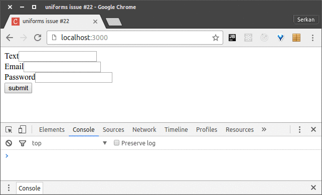

Notice that this is a barebones meteor project and nothing special, no extra
packages except for some popular base react packages.

The email error comes from react but it only gets printed when we are on RC.13 and
not on RC.12

Also notice that, the cursor always jumps to the end whenever I type in the middle
of a word, only one character gets printed and cursor jumps straight to the
last character.

